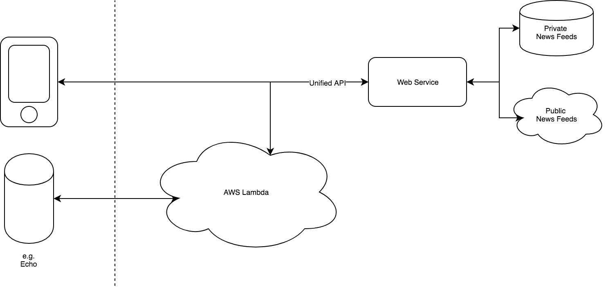
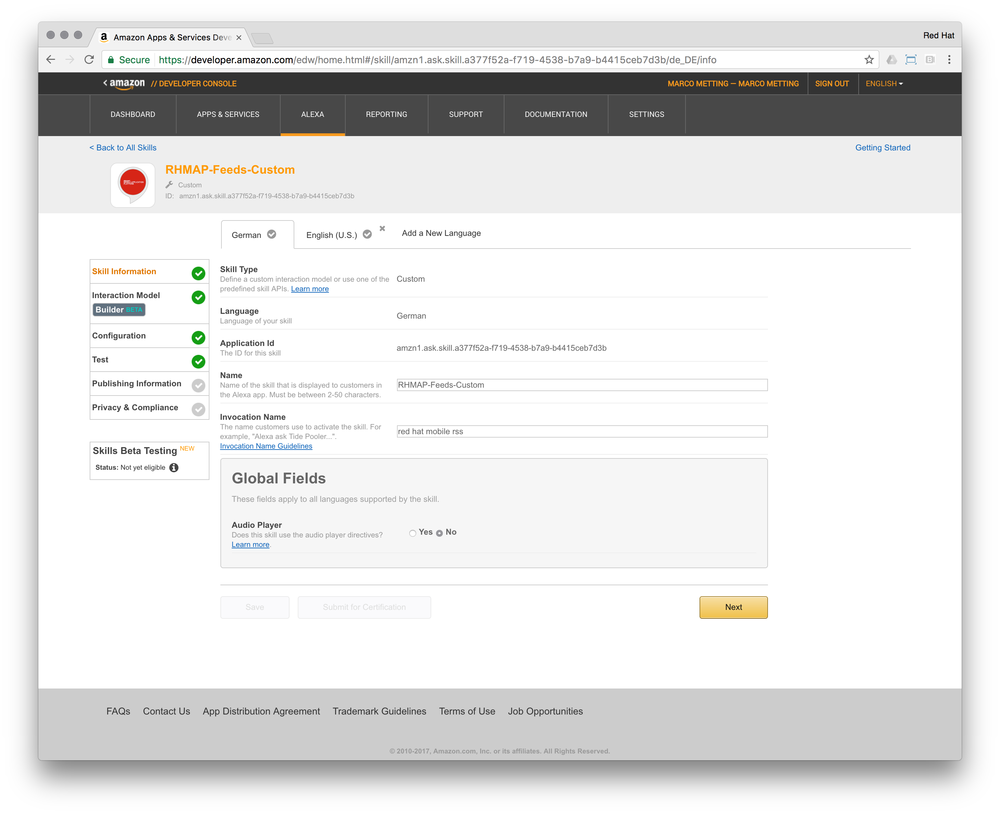
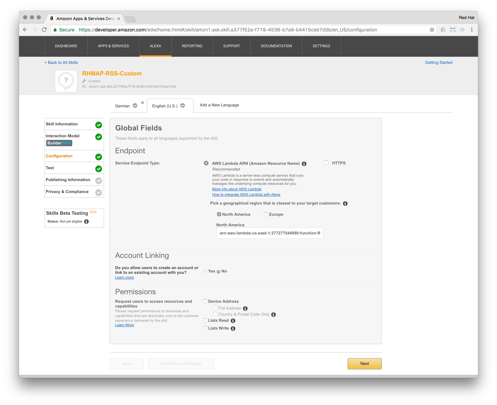
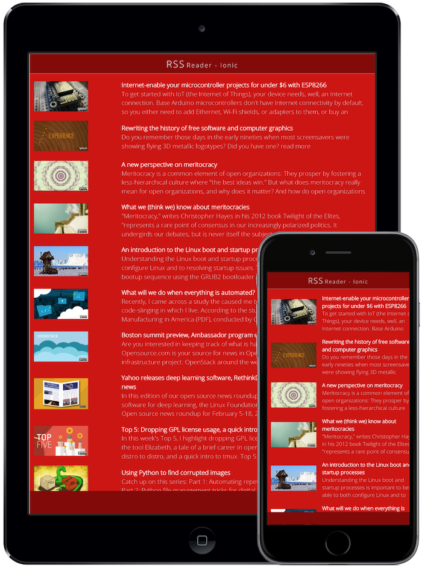

# Building an Alexa skill with Red Hat Mobile Application Platform - Part II

Continuing our journey to build Alexa Skills, we'll leverage the [Alexa Skill SDK (ASK)](http://phx.corporate-ir.net/phoenix.zhtml?c=176060&p=irol-newsArticle&ID=2062551) to create a Custom Skill providing news towards our end-user.

Let's recap the [first part](https://github.com/mmetting/Building-an-Alexa-skill-with-Red-Hat-MAP---Part-I) of this article series:

> Skills come in different flavours:
>
> 1. Flash Briefing: These skills provide original content for users’ flash briefings.
> 2. Smart Home: With these skills, users can control cloud-enabled smart-home devices like lights and thermostats.
> 3. Custom: These skills can handle just about any type of request. 

Amazon's voice service will interact with a web service hosted on the Red Hat Mobile Application Platform (RHMAP) to pull RSS feeds from the internet. At the same time, the consumption of the news could also be leveraged in a mobile app or website. In our case, we use an Ionic client app to display the news on a mobile device.


> [Red Hat Mobile Application Platform](https://www.redhat.com/en/technologies/mobile/application-platform) enables you to develop and deploy mobile apps in an agile and flexible manner. Take advantage of open technologies and standard toolkits while centralizing control over security, back-end integrations, and policy management.

## Part II: Upgrading to a Custom Skill

Where-as Flash Briefing Skills are quick to setup, their functionality is limited to only provide information without further user interaction. 

To include custom user interactions, a Custom Skill is required: Developers define the requests the skill can handle (intents) and the words users say to invoke those requests (utterances).

Let's extend our use case to build a Custom Skill to retrieve the desired RSS feeds.

### Architecture

Back-end services for Custom Skills can be built on-top of `AWS Labda` or self-hosted Web Services. In this article we'll focus on a `AWS Lambda` based skill, calling our RSS API on RHMAP.



The web service on RHMAP will be our unified API, accessing server-side functionality, thus we can re-use the same service for the mobile, web and voice controlled channel, all developed, managed & secured through Red Hat Mobile.

We started off by re-using the [RSS demo project](https://github.com/mmetting/RHMAP-RSS-Reader-Demo).

The Cloud Application in our project on RHMAP is the server side API for the client apps. It offers a REST-endpoint `/feeds` to retrieve RSS feeds in the following format:

```
{
    "title": "Hello World",
    "image": "https://opensource.com/sites/default/files/images/life/weekly_news_roundup_tv.png",
    "teaser": "Candy oat cake halvah ice cream icing bear claw brownie pie ice cream. Powder topping sugar plum lollipop brownie lollipop oat cake cookie."
}
```

The Cloud Application calls out to an MBaaS Service, which serves as the connector to the public RSS feeds.

The idea of the Cloud Application is, to be the public interface for clients. Therefore server-side business logic could be implemented in it, to orchestrate or aggregate other service calls. Additionally, the Cloud Application has access to all server-side APIs exposed by the RHMAP SDK, like Push Notifications, Data Storage, Caching, Forms or Synchronisation Support.

### Setting up the Skill

Here is an overview of the necessary steps (refer to Amazon's documentation for all [details](https://developer.amazon.com/public/solutions/alexa/alexa-skills-kit/overviews/steps-to-build-a-custom-skill)):

1. *Design a Voice User Interface*: We want our Skill to fetch RSS feeds. Therefore our interaction model will be based on a simple trigger, asking Alexa to "fetch feeds". Additionally, we want the user to be able to ask for help or stop the narration of a feed.

2. *Set Up the Skill in the Developer Portal*: We create a new Custom Skill, which can be invoked by saying: "Alexa, ask Red Hat Mobile RSS to fetch feeds".



3. *Use the Voice Design to Build Your Interaction Model*: By using the `Skill Builder`, we created an interaction model. Based on this model, Alexa will reach out to AWS Lambda to trigger the "intent" handlers. In each handler, developers have the opportunity to respond to the user's interaction by performing the necessary actions.

```
{
  "intents": [
    {
      "name": "AMAZON.CancelIntent",
      "samples": [
        "Cancel"
      ]
    },
    {
      "name": "AMAZON.HelpIntent",
      "samples": [
        "Help"
      ]
    },
    {
      "name": "AMAZON.StopIntent",
      "samples": [
        "Stop"
      ]
    },
    {
      "name": "FeedsIntent",
      "samples": [
        "Fetch feeds",
        "Fetch recent feeds",
        "Fetch most recent feeds",
        "Fetch news"
      ],
      "slots": []
    }
  ]
}
```

4. *Write and Test the Code for Your Skill*: The time has come to connect our RSS API on RHMAP to Alexa via `AWS Lambda`.



"AWS Lambda is a compute service that lets you run code without provisioning or managing servers. AWS Lambda executes your code only when needed ..."

We'll use a function / application on `AWS Lambda` to call our unified RSS API and respond to the user's interaction.

> The complete code can be found [here](./aws_lambda/index.js).

```
...
const handlers = {
    ...

    'FeedsIntent': function () {
        var feeds = this.t('FEEDS');
        
        fetchFeeds()
        .then((feeds) => {
            if (feeds.length > 0) {
                var firstFeed = feeds[0];
                this.emit(':tell', this.t('RANDOM_FEED') + firstFeed.teaser);
            }
        })
        .catch((err) => {
            this.emit(':tell', this.t('SOMETHING_WENT_WRONG'));
        });
    }
    ...
};

...

const https = require('https');
function fetchFeeds() {

    return new Promise((resolve, reject) => {
        var options = {
            hostname: 'mmetting-xjgjgwu35npdekfvycwbkama-demos-dev.mbaas2.tom.redhatmobile.com',
            port: 443,
            path: '/feeds',
            method: 'GET',
            headers: { 'Content-Type': 'application/json' }
        };

        https.get(options, (res) => {
            
            const body = [];
            
            res.on('data', (chunk) => body.push(chunk));
            res.on('end', () => {
                var feeds = JSON.parse(body.join('')).data;

                console.log(feeds);
                resolve(feeds);
            });

        }).on('error', (e) => {
            console.log(e);
            reject(e);
        });
    });
}
```

In the `FeedsIntent` handler, we perform a HTTPS GET-Request towards our RSS Cloud Application. From the response, we take the first item and read it out to the user.

5. *Test Your Custom Skill*: Enjoy the fruits of your [work](https://youtu.be/i8Xc7DauDus)!
6. Optional - Prepare for publishing
7. Optional - Submit your skill for approval

Now we can leverage our RSS Web Service not only on mobile or web apps, but also in combination with Amazon's Alexa Skills.



> Continue reading on how to host your own Skill with RHMAP [Part III](https://github.com/mmetting/Building-an-Alexa-skill-with-Red-Hat-MAP---Part-III)